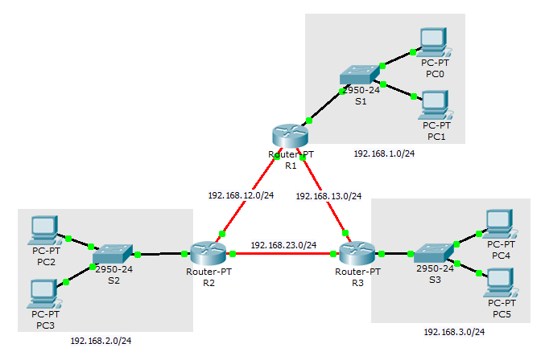

% Komunikasi Data dan Jaringan Komputer
  Praktikum #12
% Auriza Akbar
% 2015

# *Routing* Dinamis (RIP)

## Routing Statis vs Dinamis

Dua metode dasar untuk membangun tabel routing: statis dan dinamis (Balchunas 2007).

Routing statis:

- tabel routing dibuat dan di-*update* secara manual oleh admin
- rute statis untuk tiap jaringan harus dikonfigurasi pada setiap router
- menyediakan kontrol penuh pada konfigurasi routing, namun tidak praktis untuk jaringan yang besar
- tidak *fault-tolerant*, perubahan pada infrastruktur (sambungan mati, penambahan jaringan baru) membutuhkan *updating* manual

Routing dinamis:

- tabel routing dibuat dan di-*update* oleh protokol routing yang berjalan pada router.
- router membagi informasi routing dengan router lainnya secara berkala.
- mampu memilih jalur yang berbeda secara dinamis jika terdapat perubahan pada inrastruktur.
- contoh: *routing information protocol* (RIP), *enhanced interior gateway routing protocol* (EIGRP), dan *open shortest path first* (OSPF).

## *Routing Information Protocol* (RIP)

RIP pertama kali didefinisikan dalam RFC 1058 pada tahun 1988.
RIP adalah protokol vektor-jarak sederhana yang menggunakan jumlah *hop* sebagai unit metrik.
RIP didesain untuk jaringan kecil dengan jumlah *hop* maksimum 15.

Terdapat tiga versi: RIP, RIPv2, dan RIPng.
RIP hanya mendukung *classful routing*.
RIPv2 menambahkan dukungan *subnetting* dan *classless inter-domain routing* (CIDR).
RIPng adalah ekstensi dari RIPv2 untuk jaringan IPv6 (Nemeth *et al.* 2010).

Walaupun terkesan kuno, namun RIP masih banyak digunakan karena sederhana, mudah dikonfigurasi, dan bekerja dengan baik pada jaringan berkompleksitas rendah.

## Routing dinamis dengan protokol RIP

- siapkan tiga router (Router-PT): R1, R2, dan R3, hubungkan dengan kabel fiber
- siapkan jaringan LAN (switch dan beberapa PC) untuk tiap router: `192.168.1.0/24`, `192.168.2.0/24`, dan `192.168.3.0/24`
- set IP statis dan gateway untuk tiap PC

### Konfigurasi router R1

- set IP router R1 yang terhubung ke LAN

    ~~~
    enable
    configure terminal
    interface FastEthernet0/0
        ip address 192.168.1.1 255.255.255.0
        no shutdown
        exit
    ~~~

- set IP router R1 yang terhubung dengan router lainnya

    ~~~
    interface FastEthernet4/0
        ip address 192.168.12.1 255.255.255.0
        no shutdown
        exit
    interface FastEthernet5/0
        ip address 192.168.13.2 255.255.255.0
        no shutdown
        exit
    ~~~

- konfigurasi RIP pada tabel routing, tambahkan **semua jaringan yang terhubung langsung** dengan router R1

    ~~~
    router rip
        network 192.168.1.0
        network 192.168.12.0
        network 192.168.13.0
    ~~~

- lanjutkan dengan konfigurasi _R2_ dan _R3_

### Konfigurasi router R2

~~~
R2>enable
R2#configure terminal

R2(config)#interface FastEthernet0/0
R2(config-if)#ip address 192.168.2.1 255.255.255.0
R2(config-if)#no shutdown
R2(config-if)#exit

R2(config)#interface FastEthernet5/0
R2(config-if)#ip address 192.168.12.2 255.255.255.0
R2(config-if)#no shutdown
R2(config-if)#exit

R2(config)#interface FastEthernet4/0
R2(config-if)#ip address 192.168.23.1 255.255.255.0
R2(config-if)#no shutdown
R2(config-if)#exit

R2(config)#router rip
R2(config-router)#network 192.168.2.0
R2(config-router)#network 192.168.12.0
R2(config-router)#network 192.168.23.0
R2(config-router)#
~~~

### Konfigurasi router R3

~~~
R3>enable
R3#configure terminal

R3(config)#interface FastEthernet0/0
R3(config-if)#ip address 192.168.3.1 255.255.255.0
R3(config-if)#no shutdown
R3(config-if)#exit

R3(config)#interface FastEthernet4/0
R3(config-if)#no ip address
R3(config-if)#ip address 192.168.13.1 255.255.255.0
R3(config-if)#no shutdown
R3(config-if)#exit

R3(config)#interface FastEthernet5/0
R3(config-if)#ip address 192.168.23.2 255.255.255.0
R3(config-if)#no shutdown
R3(config-if)#exit

R3(config)#router rip
R3(config-router)#network 192.168.3.0
R3(config-router)#network 192.168.13.0
R3(config-router)#network 192.168.23.0
R3(config-router)#
~~~

- cek koneksi ketiga jaringan tersebut (mode realtime dan simulasi)

## Perintah Lainnya

Lihat dokumentasinya di halaman [RIP commands](http://www.cisco.com/c/en/us/td/docs/ios/12_2/iproute/command/reference/fiprrp_r/1rfrip.html).

## Referensi

Balchunas A. 2007. Static vs dynamic routing [Internet]. [diunduh 2013 Apr 16]. Tersedia pada: <http://www.routeralley.com/ra/docs/static_dynamic_routing.pdf>.

Nemeth E, Snyder G, Hein TR, Whaley B. 2010. *UNIX and Linux System Administration Handbook*. 4th ed. Ann Arbor (US): Prentice Hall.
